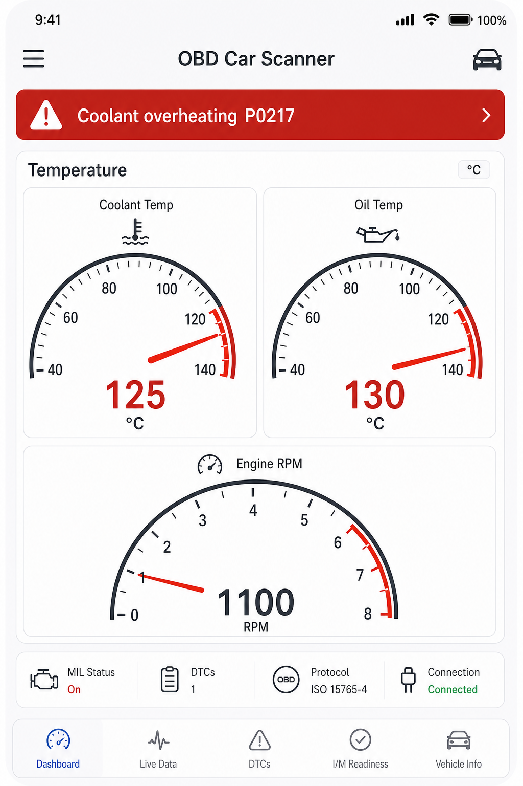

# OBD Bridge (omni) — Pi · Mac · Simulator

Vehicle-agnostic **ELM327 bridge** and **Docker ECU simulator** for iPhone apps such as **Car Scanner**.

Works with typical OBD-II vehicles (Subaru Crosstrek, Nissan Kicks, and others). Brand extras use Car Scanner manufacturer profiles on a real car.

**Docs:** [docs/README.md](docs/README.md) · **Start here:** [docs/GETTING_STARTED.md](docs/GETTING_STARTED.md)

## 60-second demo (no car)

```bash
git clone https://github.com/kevinmullin/odb2-pi-bridge.git
cd odb2-pi-bridge
make simulate
make simulate-test
```

iPhone (same Wi‑Fi) → Car Scanner → Wi‑Fi → **`ipconfig getifaddr en0`** port **`35000`**.


Overheat demo:

```bash
make simulate SCENARIO=overheat
```



## Make targets

| Target | Purpose |
|--------|---------|
| `make build` / `make ci` | Lint in Docker |
| `make simulate` | Fake ECU on `:35000` (`PROFILE`, `SCENARIO`) |
| `make simulate-test` | Reliable ATZ/0105 smoke test |
| `make simulate-stop` | Stop simulator |
| `make macos-setup` | Host socat + LaunchAgent |

## Paths

| Path | Guide |
|------|--------|
| Simulator visuals | [docs/GETTING_STARTED.md](docs/GETTING_STARTED.md), [docs/SIMULATOR.md](docs/SIMULATOR.md) |
| Mac + BAFX | [docs/MACOS.md](docs/MACOS.md) |
| Pi in car | [docs/PI.md](docs/PI.md) |
| Errors / `nc` / ignition | [docs/TROUBLESHOOTING.md](docs/TROUBLESHOOTING.md) |

## Pi quick install

```bash
sudo ./install.sh
```

AP SSID **`obd-bridge`**, ELM at **`192.168.4.1:35000`**.

## License

MIT
