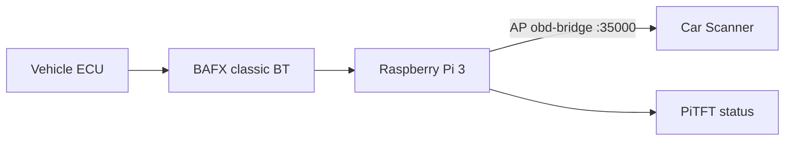
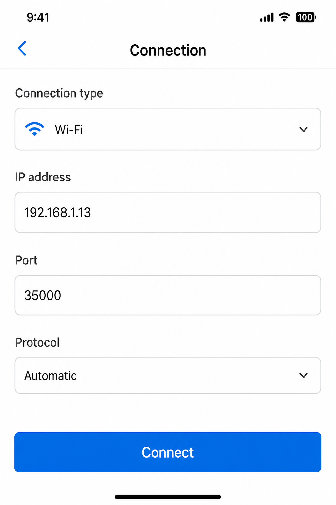

# Raspberry Pi in-car bridge

Turns an Android-only classic Bluetooth ELM327/BAFX into a Wi‑Fi ELM327 AP for iPhone apps. Vehicle-agnostic (Crosstrek, Kicks, other OBD-II).

**Autopair** retries until the adapter is seen — **no home Wi‑Fi needed in the car**. Optional **Adafruit PiTFT 2.8" resistive** shows status and a Pair button ([PITFT.md](PITFT.md)).



## Prerequisites

- Raspberry Pi 3 (recommended) with Raspberry Pi OS Lite
- SSH user/password set in Imager; Wi‑Fi country set
- **Ethernet for first install only** (apt/git). Not needed later in the car.
- BAFX for pairing (ignition ON) — can be later; autopair waits
- Optional: Adafruit PiTFT 2.8" **resistive** ([PITFT.md](PITFT.md))

## Desk install (once, with ethernet)

```bash
git clone https://github.com/kevinmullin/odb2-pi-bridge.git
cd odb2-pi-bridge
# If BAFX is not plugged in at the desk:
sudo SKIP_PAIR=1 ./install.sh
```

If the PiTFT is attached, install Adafruit **`28r`** drivers **before** or after this (see [PITFT.md](PITFT.md)), then reboot so `/dev/fb1` exists and the UI starts.

Defaults:

| Setting | Value |
|---------|--------|
| SSID | `obd-bridge` |
| Password | `obdbridge1` |
| ELM host | `192.168.4.1:35000` |

## Car: first pair (no home Wi‑Fi)

1. Power the Pi (USB / cigarette adapter).  
2. Plug BAFX into OBD, **ignition ON**.  
3. Wait — autopair scans every ~15s until paired (PiTFT shows **scanning** → **paired**).  
4. Or tap **Pair / Re-pair** on the PiTFT.  

No SSH required.

## iPhone

1. Join Wi‑Fi **`obd-bridge`** / **`obdbridge1`**.  
2. Car Scanner → Wi‑Fi → **`192.168.4.1`** port **`35000`**.  



## Operator commands (optional SSH)

```bash
obd-bridge status
sudo obd-bridge doctor
sudo obd-bridge pair
sudo journalctl -u obd-bridge-autopair -f
```

## Services

| Unit | Role |
|------|------|
| `obd-bridge-autopair` | Retry pair until `device.env` has `BT_MAC` |
| `obd-bridge-rfcomm` | Bluetooth SPP reconnect |
| `obd-bridge-proxy` | TCP `:35000` ↔ `/dev/rfcomm0` |
| `obd-bridge-pitft` | 320×240 status UI (`/dev/fb1`) |
| `obd-bridge-health.timer` | Journal health lines |

## Uninstall

```bash
sudo ./uninstall.sh
sudo ./uninstall.sh --purge
```
