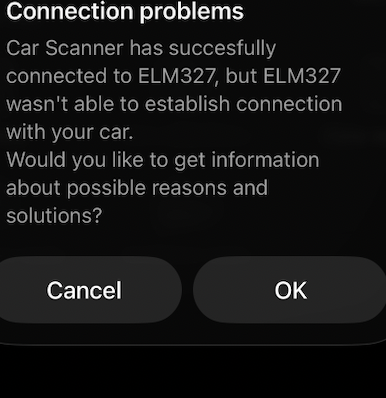

# Troubleshooting

## Car Scanner: connected to ELM327 but not the car



**Meaning:** TCP reached the adapter/simulator, but OBD protocol / ECU probes failed. The app often also says **ignition must be on**.

### If you are using `make simulate`

1. Confirm a recent simulator image is running:

   ```bash
   make simulate-stop
   make simulate
   make simulate-test
   ```

2. Force-quit Car Scanner, reconnect to **Mac LAN IP:35000**.
3. Check logs for the app’s commands:

   ```bash
   docker logs -f obd-elm-sim
   ```

You should see `CMD 'AT…'` / `CMD '0100'` lines. Current builds fake **ignition ON**, **CAN**, **13.8V**, and `SEARCHING...`.

### If you are using a real BAFX

- Ignition **ON** (or engine running).
- Adapter LED on; paired to the Pi/Mac.
- `obd-bridge doctor` / `obd-bridge-mac doctor`.

## `nc` only shows `>`

Normal on macOS. ELM uses `\r` without newlines, and pipes close too fast.

Use:

```bash
make simulate-test
# or
(printf 'ATZ\r'; sleep 1) | nc 127.0.0.1 35000 | cat -v
```

## Phone cannot connect to simulator

| Check | Action |
|-------|--------|
| Same Wi‑Fi | Mac and iPhone on same SSID |
| Correct IP | `ipconfig getifaddr en0` — update Car Scanner if DHCP changed |
| Port | `35000` |
| Container up | `docker ps --filter name=obd-elm-sim` |
| Firewall | Allow Docker / incoming local network |

## `make build` / Docker errors

- Start **Docker Desktop**.
- Retry `make build` / `make simulate`.
- CI runs the same lint path: `make ci`.

## Overheat scenario not climbing

Ramp is ~75s from **container start**. Restart to reset:

```bash
make simulate SCENARIO=overheat
```

Watch coolant PID:

```bash
python3 simulator/smoke_test.py 0105
```

`41 05 AA` → temp °C ≈ `AA` hex − 40.

## Bluetooth pair fails on Mac

- Classic SPP clones vary on Apple Silicon.
- Confirm a `/dev/cu.*` appears after pairing (`obd-bridge-mac find-device`).
- If no `cu` device ever appears, use the **Pi** bridge or a BLE ELM327 for iPhone-native adapters.

## Still stuck

Collect:

```bash
make simulate-test
docker logs --tail 100 obd-elm-sim
obd-bridge-mac doctor    # if using Mac hardware path
```

Open an issue on https://github.com/kevinmullin/odb2-pi-bridge with that output.
